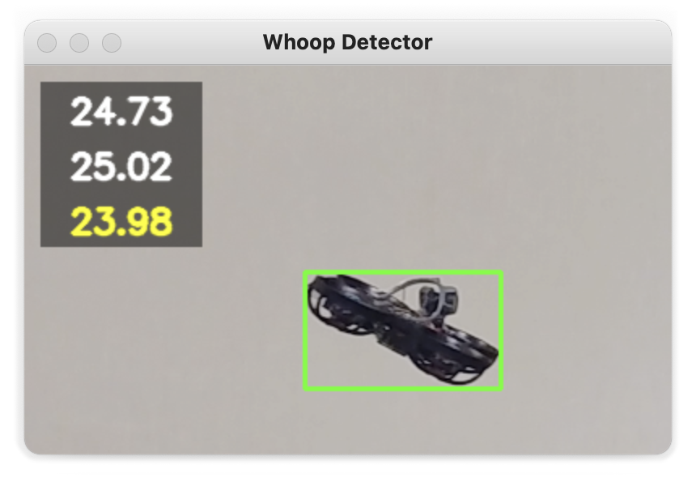

# Whoop Detector

* Webcam based timing system for indoor micro quads.
* Use integrated laptop front camera or external USB camera.
* Perfect for individual trainings.

[Video](https://youtu.be/SmLjgBpX1IA)

### How it works
1) Point your camera on the wall or on the floor.
2) Launch script `detector.py`.
3) When any moving object appears in the camera field-of-view, a new lap is detected.

### How to install
1) Get the latest version of [Python](https://www.python.org/downloads/).  
Set "Add Python to PATH" checkbox while installing.
2) Install additional modules. Type in command line:  
`pip3 install opencv-python`  
`pip3 install playsound`

### Controls
| Key  | Function |
|:----:|:--------:|
| Space | Pause |
| C | Clear results |
| P | Show/hide plot |
| M | Show/hide movement |
| +/− | Adjust sensitivity |
| Esc | Exit |

### Tips
* Use well illuminated environment.
* If you have more than one webcam in your system, you may need to change `camera_id` parameter from 0 to 1 in `config.ini`.
* If the software crashes with sound module errors, try to install previous version of module: `pip3 install playsound==1.2.2`

---
Feel free to contact me in Telegram: [@AlexeyStn](https://t.me/AlexeyStn)
